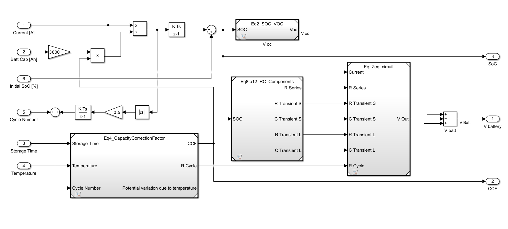
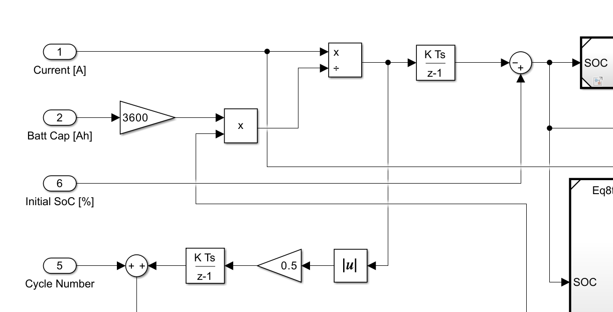

# Table of Contents
- [Table of Contents](#table-of-contents)
- [Introduction](#introduction)
- [MATLAB / Simulink](#matlab--simulink)
  - [File Structure](#file-structure)
    - [Blocks](#blocks)
    - [Scripts](#scripts)
  - [Model Description](#model-description)
  - [Simulink - How to simulate](#simulink---how-to-simulate)
   
# Introduction
The MATLAB/Simulink model is based on the paper "[A Dynamic Lithium-ion battery model considering the effects of the termperature and capacity fading](../Papers/A_dynamic_lithium-ion_battery_model_considering_the_effects_of_temperature_and_capacity_fading.pdf)"

# MATLAB / Simulink
## File Structure
The `Blocks` folder contains the Simulink blocks.

The `Scripts` folder contains the MATLAB scripts used to launche the MATLAB simulation and the text files containing the input data for the simulation.
```
Matlab
├── Blocks
│   ├── complete_model.slx
│   ├── simulation.slx
│   ├── *.slx
├── Scripts
│   ├── simulink_simulation.m
│   ├── plot_simulation_csv.m
│   ├── data
│   │   ├── input_data.txt
│   │   ├── input_control.txt
│   │   └── result.csv

```
### Blocks 
Each block is named after the number of the equation found on the paper ([A Dynamic Lithium-ion battery model...](../Papers/A_dynamic_lithium-ion_battery_model_considering_the_effects_of_temperature_and_capacity_fading.pdf)) on which the model is based on.

|File name| Description|
|:---:|:---:|
|`complete_model.slx`|Contains the complete model made up of all the other Simulink blocks|
|`simulation.slx`|Contains the `complete_model` block and connects it to the input and output variables of MATLAB|

### Scripts
|File name| Description|
|:---:|:---:|
|`delta_E_regression.m`|Script that finds the potential correction term that is dependant on the temperature. Refer to [this paper](../Papers/Dynamic_Lithium-ion_battery_model_for_system_simulation.pdf) at **Fig. 6**|
|`plot_simulation_csv.m`|Script that plots the output data of the **C Model** contained in the `/data/result.csv` |
|`simulink_simulation.m`|Script that launches the simulation of the Simulink model `/Blocks/simulation.slx`|
## Model Description


*Complete Simulink model*

The above picture shows the complete Simulink model. Four main blocks contain the additional blocks, each is named after the equation it implements.



*Detail of Simulink model*

The following expressions are implemented in the detailed view of the Simulink model

$C_{rate} = \frac{current}{capacity*3600}$

$SoC_{tot} = SoC_{init} + \int C_{rate}$

$N_{cycle} = N_{init} + \int |\frac{C_{rate}}{2}|$

The idea behind the cycle number counter was con consider each full charge/discharge cycle as a cycle. In this way the counting was made easy by using the c-rate computed above.

## Simulink - How to simulate
- The model inputs are passed via the file `/data/input_data.txt`
- Some battery voltage constraints (**V_max** and **V_min**) can be set in `/data/input_control.txt`: the simulation is stopped when the output voltage of the battery leaves the interval between **V_max** and **V_min**.
- Executing `simulink_simulation.m` launches the simulation.
- The output data are shown on plots.
