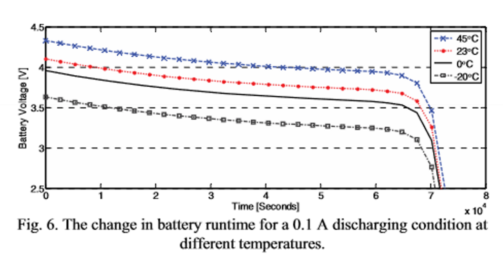

## Results

### Discharge behavior at different temperatures

*Screenshot taken from the paper: [A Dynamic Lithium-ion Battery Model...](./Papers/A_dynamic_lithium-ion_battery_model_considering_the_effects_of_temperature_and_capacity_fading.pdf)*

*Simulation results of our model. [Timeseries file](./Docs/files/DischargeDifferentTemperatures.mat)*