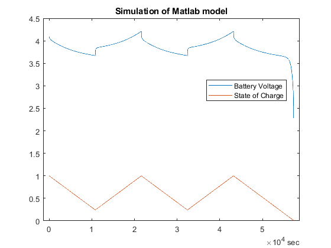
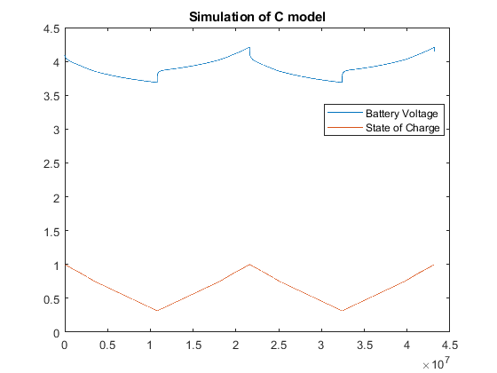

# EMIOT project
Project for the Energy Management for IoT Course @ Politecnico di Torino (A.Y. 2022-23)

## Description
Modeling of battery behavior during charging and discharging cycles. The model is developed using MATLAB/Simulink, then translated to simple C/C++ code to be simulated on PC, lastly it is ported to an MCU. The project is based on multiple [papers](Papers)

## Current State

### Part 1
- [ ] Realistic input data 
- [x] SoC to Voc block
- [x] Circuit parameters
- [x] Circuit model (Simscape)
- [x] k1, k2, k3 parameters modeling with temperature
- [x] Potential variation due to temperature
- [x] Dynamic cycle counting

### Part 2


- [x] Model translation to C/C++ 
  - [x] Parametric simulation clock
  - [x] Simulink blocks
  - [x] Circuit model (Zeq)
- [x] Simulation in C
  - [x] Input data generation from file
  - [x] Saving siulation results to file (.csv)
  - [x] Printing results on console

Example:
Example of the console output of a simulation run

```
**********
TIME:           0.000 s
Current:        0.000000 A
V Batt:         3.959059 V
CCF:            98.73 %
SoC:            75.00 %
**********
TIME:           600.000 s
Current:        1.000000 A
V Batt:         3.707443 V
CCF:            98.73 %
SoC:            58.03 %
**********
TIME:           1800.000 s
Current:        1.000000 A
V Batt:         3.608337 V
CCF:            98.72 %
SoC:            25.42 %
```


### Part 3

- [ ] Porting to MCU

## Results

Comparison between the simulation of the Matlab/Simulink model and the C code model:



*Simulation results of Matlab/Simulink model.*



*Simulation results of C code model.*


Some relevant results can be seen in [results.md](./Docs/results.md)


## Issues

- [x] ~~Inconsistent variable types between model and functions~~
- [x] ~~Model files of type .cpp instead of .c (compilation issues)~~
- [x] ~~General naming convention for variables and functions~~
  - Proposed snake_case for variable and CamelCase for functions
- [ ] General buggyness 


