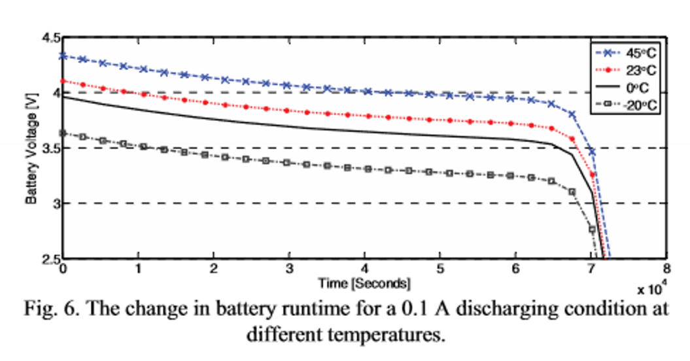
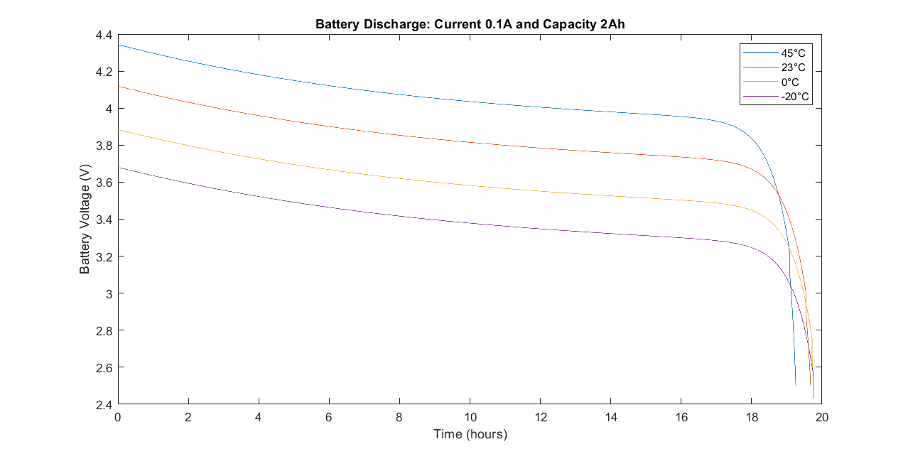

# EMIOT project
Project for the Energy Management for IoT Course @ Politecnico di Torino (A.Y. 2022-23)

## Description
Modeling of battery behavior during charging and discharging cycles. The model is developed using MATLAB/Simulink, then translated to simple C/C++ code to be simulated on PC, lastly it is ported to an MCU. The project is based on multiple [papers](Papers)

## Current State

### Part 1
- [ ] Realistic input data 
- [x] SoC to Voc block
- [x] Circuit parameters
- [x] Circuit model (Simscape)
- [x] k1, k2, k3 parameters modeling with temperature
- [x] Potential variation due to temperature
- [ ] ~~Cycle counting algorithm (rainflow counting?)~~

### Part 2
- [ ] Translation to C/C++
- [ ] Simulation

### Part 3

- [ ] Porting to MCU

## Issues

### Discharge behavior at different temperatures

*Screenshot taken from the paper: [A Dynamic Lithium-ion Battery Model...](./Papers/A_dynamic_lithium-ion_battery_model_considering_the_effects_of_temperature_and_capacity_fading.pdf)*

*Simulation results of our model. [Timeseries file](./Docs/SimulationResults.mat)*

- Why do the discharging curves, especially the one at 45°C, not match the behavior seen in the first graph? 

