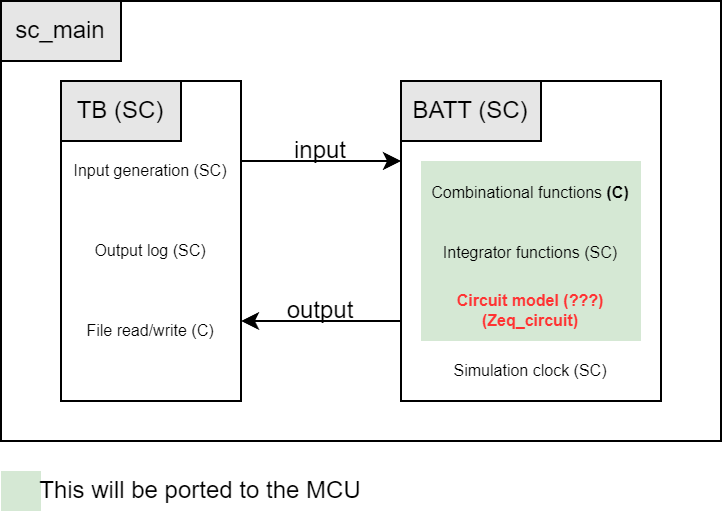

# EMIOT project
Project for the Energy Management for IoT Course @ Politecnico di Torino (A.Y. 2022-23)

## Description
Modeling of battery behavior during charging and discharging cycles. The model is developed using MATLAB/Simulink, then translated to simple C/C++ code to be simulated on PC, lastly it is ported to an MCU. The project is based on multiple [papers](Papers)

## Current State

### Part 1
- [ ] Realistic input data 
- [x] SoC to Voc block
- [x] Circuit parameters
- [x] Circuit model (Simscape)
- [x] k1, k2, k3 parameters modeling with temperature
- [x] Potential variation due to temperature
- [x] Dynamic cycle counting

### Part 2
#### Block Diagram for Part 2

*Block diagram of SystemC model*

- [x] Model translation to C/C++ 
  - [x] Parametric simulation clock
  - [x] Simulink blocks
  - [x] Circuit model (Zeq)
- [ ] SystemC Testbench
  - [ ] Input data generation from file
  - [ ] Saving siulation results to file (.csv)
- [ ] Simulation with SystemC

### Part 3

- [ ] Porting to MCU

## Results
Some relevant results can be seen in [results.md](./Docs/results.md)

## Issues

- [ ] Inconsistent variable types between model and functions
- [ ] Model files of type .cpp instead of .c (compilation issues)
- [ ] General naming convention for variables and functions
  - Proposed snake_case for variable and CamelCase for functions
- [ ] General buggyness 

